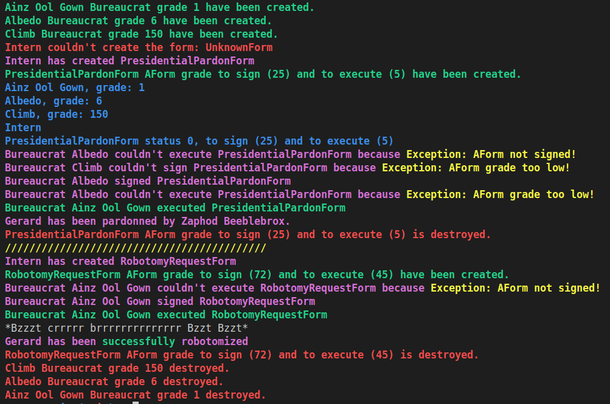
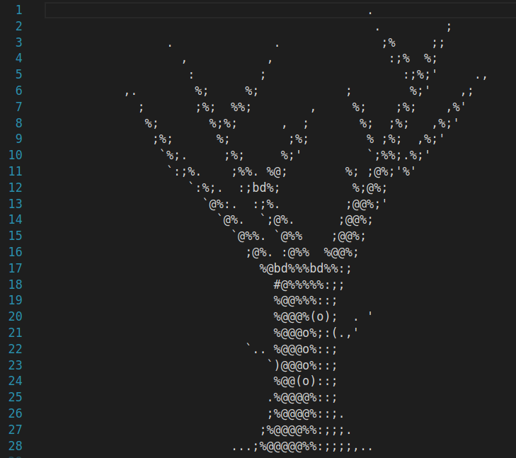

# CPP learning module 05 of 42 School

## Summary

[About the project](#about-the-project)

[Exercices](#exercices)

[Links](#links)

[Screenshots](#screenshots)

## About the Project

This project is the `CPP 06` learning module of 42 School.
All the C++ modules are based on C++98.

This project focuses on [try catch throw](https://learn.microsoft.com/fr-fr/cpp/cpp/try-throw-and-catch-statements-cpp?view=msvc-170) and [exception](https://en.cppreference.com/w/cpp/error/exception).

## Exercices

### ex00

Add class & exeptions :
- A `Bureaucrat`. They have a grade (1 highest and 150 lowest).
- For example `GradeTooLow`  exception...

### ex01

Add a `Form` class.
The Bureaucrats can now `sign` the forms if they have the right to, based on the grade.

### ex02

Make Form AForm `Abstract`. (In order to make inheritance only).
Bureaucrat can now `execute` forms if they have the right to based on the grade.

Create 3 types of formular : 
- `ShrubberyCreation` (Create a file with and put an ascii tree in it)
- `PresidentialPardon` (inform that the target has been pardonned)
- `Robotomization` (Have a chance to robotomize the bureaucrat)

### ex03 

#### make an Intern class
An `intern` have no name, no grade. They can only make `Forms` based on demand.

They receive a `makeForm request` with the name of the form and the target. If the name is part of the 3 form types, then they create it. If not, they print an error.

## Links

You can find my other CPP modules here :
- [CPP_00](https://github.com/Kwro91/cpp00) Class, Namespaces, Member function, Static, Const & basics.

- [CPP_01](https://github.com/Kwro91/cpp01) Memory allocation, Pointer & Reference, Switch case.

- [CPP_02](https://github.com/Kwro91/cpp02) Polymorphism (overloading), Canonical form.

- [CPP_03](https://github.com/Kwro91/cpp03) Inheritance.

- [CPP_04](https://github.com/Kwro91/cpp04) Polymorphism (overriding), Derived class, Abstract class, Interface.

- [CPP_05](https://github.com/Kwro91/cpp05) : Try & catch, Exceptions.

- [CPP_06](https://github.com/Kwro91/cpp06) : Cast, Type conversion.

## Screenshots

